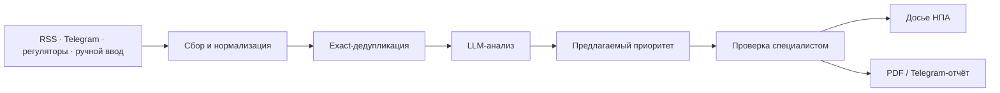

[@reg_radar_product_hack_bot](https://t.me/reg_radar_product_hack_bot)

<div align="center">
  
  <h1>RegRadar</h1>
  <p><strong>ИИ-аналитический центр для PR/GR-команд регулируемых компаний</strong></p>
  <p>Сигнал → проверяемый AI-анализ → решение специалиста → отчёт руководителю</p>
  <p>
    <a href="https://regradar-demo.209-250-246-26.sslip.io"><strong>Открыть демо</strong></a>
    ·
    <a href="https://t.me/reg_radar_product_hack_bot">Telegram Mini App</a>
    ·
    <a href="project_analysis/RegRadar_Final_Report.pdf">Финальный отчёт</a>
    ·
    <a href="project_analysis/RegRadar_Presentation.pdf">Презентация</a>
  </p>
</div>

> RegRadar — прототип для AI Product Hack по кейсу GS Labs. Публичный стенд
> работает на временном VPS; после завершения демонстрационного периода ссылка
> может быть отключена.

## Зачем нужен RegRadar

PR/GR-специалист ежедневно просматривает СМИ, публикации регуляторов и отраслевые
Telegram-каналы, выделяет важные события, обновляет реестр НПА и готовит повестку
для руководителя. RegRadar объединяет эти шаги в один проверяемый процесс.

Система не принимает решение вместо человека. AI формирует краткое резюме,
извлекает факты и сущности, предлагает категорию и приоритет. Специалист видит
основания оценки, подтверждает или исправляет результат, а история AI-версий и
решений сохраняется раздельно.

## Что реализовано

- автоматический сбор 13 настроенных RSS- и Telegram-источников каждые 15 минут;
- ручное добавление, редактирование, скрытие и восстановление публикаций;
- LLM-саммаризация, извлечение фактов и сущностей, категоризация и объяснимый
  предлагаемый приоритет;
- автоматический анализ новых полнотекстовых материалов после сбора;
- exact-дедупликация: одно событие отображается одной карточкой с несколькими
  первоисточниками;
- очередь semantic-кандидатов для решения специалиста без автоматического удаления;
- append-only решения специалиста и история версий анализа;
- досье нормативных документов с историей стадий и официальными основаниями;
- поиск, фильтры, сортировка от новых событий к старым и режимы «Кратко»/«Подробно»;
- конструктор управленческого дайджеста, экспорт в PDF и отправка в Telegram;
- Telegram Mini App с серверной проверкой подписи `initData`;
- персональные Telegram-уведомления о новых релевантных материалах;
- развёртывание на CPU VPS через Docker Compose и Caddy с HTTPS.

## Как устроен продукт



Backend построен как модульный монолит на FastAPI и SQLAlchemy. Данные MVP
хранятся в SQLite с WAL mode. Frontend реализован на React, TypeScript и Vite.
LLM подключается через заменяемый adapter: replay для тестов, локальный Hugging
Face или внешний OpenAI-compatible API.

## Быстрый запуск

Требования: Python 3.12+, Node.js 20+ и npm.

### 1. Backend

```bash
python3 -m venv .venv
.venv/bin/python -m pip install -r backend/requirements-dev.txt
.venv/bin/python -m uvicorn backend.app.main:app \
  --reload --host 127.0.0.1 --port 8000
```

Проверка: [http://127.0.0.1:8000/api/health](http://127.0.0.1:8000/api/health).

### 2. Frontend

```bash
npm --prefix frontend ci
VITE_API_BASE_URL=http://127.0.0.1:8000 \
  npm --prefix frontend run dev -- --host 127.0.0.1 --port 5173
```

Интерфейс: [http://127.0.0.1:5173/feed](http://127.0.0.1:5173/feed).

### 3. Реальные источники

```bash
.venv/bin/python scripts/sync_live_sources.py --db .local/live.sqlite3
.venv/bin/python scripts/run_collection_worker.py --db .local/live.sqlite3 --once
```

Без `--once` worker выполняет первый проход сразу, затем повторяет сбор каждые
15 минут, анализирует ограниченную пачку новых материалов и запускает Telegram-
доставку.

## Настройка AI и Telegram

Для внешнего LLM-провайдера используются переменные:

```dotenv
HACK_LLM_PROVIDER=openai_compatible
HACK_LLM_API_BASE_URL=https://provider.example/api/v1
HACK_LLM_API_MODEL_ID=model-id
HACK_LLM_API_KEY=replace-me
```

Telegram Mini App требует `HACK_TELEGRAM_BOT_TOKEN` и публичный HTTPS URL. Секреты
не должны попадать в Git. В Docker Compose они передаются через игнорируемые файлы
`deploy/secrets/llm_api_key` и `deploy/secrets/telegram_bot_token`.

Полные инструкции: [развёртывание](docs/DEPLOYMENT.md) и
[Telegram Mini App](docs/TELEGRAM_WEB_APP.md).

## Проверка проекта

```bash
# Backend и контракты
.venv/bin/python -m pytest backend/tests -q
.venv/bin/python scripts/evaluate_analysis.py
.venv/bin/python scripts/evaluate_dedup.py
.venv/bin/python scripts/measure_runtime_metrics.py

# Frontend
npm --prefix frontend run generate:api
npm --prefix frontend run typecheck
npm --prefix frontend run lint
npm --prefix frontend run test -- --run
npm --prefix frontend run build

# Сквозной браузерный сценарий
npm --prefix frontend run e2e
```

Синтетические данные используются только во временных БД автотестов. Обычный
runtime и публичный стенд работают с реальным каталогом источников.

## Структура репозитория

```text
.
├── backend/             FastAPI, доменные модули и тесты
├── frontend/            React/Vite интерфейс и frontend-тесты
├── contracts/           OpenAPI-контракт и эталонные JSON
├── data/
│   ├── live/            каталог реальных источников
│   ├── seed/            fixtures изолированных тестов
│   └── eval/            воспроизводимые измерения
├── deploy/              Docker Compose, Dockerfiles и Caddy
├── scripts/             сбор, bootstrap, eval и backfill
├── tests/e2e/           сквозные браузерные сценарии
├── docs/                актуальная инженерная документация
└── project_analysis/    финальные материалы защиты
```

`contracts/openapi.yaml` — источник истины для HTTP API. Каталог `contracts/`
нужен для генерации TypeScript-схем и контрактных тестов, поэтому является частью
итогового решения, а не вспомогательным артефактом.

## Материалы защиты

- [Финальный отчёт](project_analysis/RegRadar_Final_Report.pdf)
- [Презентация](project_analysis/RegRadar_Presentation.pdf)
- [Бизнес-анализ](project_analysis/business_analysis.md)
- [Бенчмаркинг](project_analysis/benchmarking.md)
- [Видение продукта и прототип](project_analysis/product_vision.md)
- [Выводы по итогам хакатона](project_analysis/product_conclusion.md)

## Инженерная документация

- [Архитектура решения](docs/FULL_ARCHITECTURE.md)
- [Функции MVP и сценарии ручной проверки](docs/MVP_FEATURES_AND_TESTING.md)
- [Сквозной E2E-сценарий](docs/E2E_SCENARIO.md)
- [Автоматическое формирование досье НПА](docs/AUTOMATIC_NPA_CASES.md)
- [Роли и режимы отображения](docs/ROLES_AND_VIEWS.md)
- [Методика важности](docs/IMPORTANCE_SCORING.md)
- [Метрики и протокол валидации](docs/METRICS_VALIDATION.md)
- [Каталог источников](docs/SOURCE_INVENTORY.md)
- [Развёртывание](docs/DEPLOYMENT.md)
- [Telegram Mini App](docs/TELEGRAM_WEB_APP.md)
- [Pre-release checklist](docs/PRE_RELEASE_CHECKLIST.md)

## Что ещё требует проверки

Функциональная готовность не равна подтверждённому качеству модели. Точность
категоризации, отсутствие сценария «критичное → низкий», фактологичность саммари и
сокращение утреннего разбора до 10–15 минут остаются целевыми ориентирами до
проверки на независимо размеченном датасете и пользовательского хронометража.

---

<div align="center">
  <strong>Команда RegRadar · AI Product Hack · GS Labs</strong>
</div>
