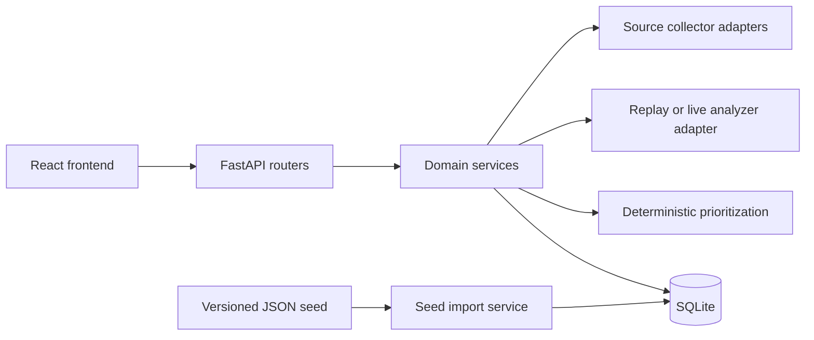
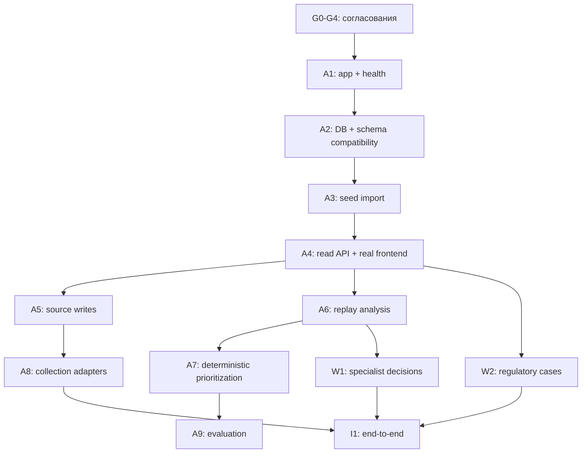

# Backend: архитектура и проверяемый TODO

Статус: **рабочий план, не protected context**
Дата: 2026-09-05
Ветка: `feat/content-pipeline`

Полная картина системы, включая LLM и фактический frontend:
[`FULL_ARCHITECTURE.md`](FULL_ARCHITECTURE.md).

Реестр и intake источников: [`SOURCE_INVENTORY.md`](SOURCE_INVENTORY.md).

Этот файл декомпозирует реализацию зафиксированного API v0.4.0. Он не заменяет
`AGENTS.md`, `rules.md`, `README.md` или `contracts/openapi.yaml`.

## 1. Источники истины и границы

При конфликте используем такой порядок:

1. прямой запрос пользователя;
2. `AGENTS.md` и `rules.md`;
3. `contracts/openapi.yaml`;
4. `README.md` и эталонные JSON из `contracts/examples/`;
5. `data/seed/*.json`;
6. этот TODO.

**Факты:**

- backend A1–A9 и основной human-in-the-loop workflow реализованы в рабочей ветке
  `feat/content-pipeline`;
- контракт содержит 22 HTTP-операции;
- frontend использует read/write API публикаций, источников, анализов, решений,
  semantic duplicate review и lifecycle НПА;
- offline seed содержит 5 источников, 10 публикаций и 10 replay-анализов;
- `scripts/seed_demo.py` уже создаёт SQLite-таблицы `sources`, `publications` и
  `analysis_versions` и повторно импортирует данные без дублей;
- `project_analysis/` принадлежит продуктовому контуру и для backend-работ read-only;
- `README.md`, `rules.md`, `AGENTS.md`, `contracts/`, примеры и seed относятся к
  защищённому контексту в объёме, указанном в `AGENTS.md` и `rules.md`.

**Вывод:** базовый вертикальный срез и live intake реализованы; следующий приоритет —
полнотекстовая загрузка коротких RSS-анонсов, независимая разметка качества AI и
дублей, ускорение массового backfill embeddings и развёртывание demo-сервера.

**Владение:** по уточнению пользователя весь backend, включая задачи `W`, относится
к текущему backend-контуру. Владелец frontend отвечает за UI; изменения контракта
синхронизируются с frontend types/mocks и фиксируются отдельно.

## 1.1–1.9. Функциональная архитектура backend

Этот раздел отвечает на вопрос «что последовательно делает backend». Технические
задачи A/C/W ниже отвечают на вопрос «какими маленькими изменениями это реализовать».

### 1.1. Сбор данных

Backend должен принимать материалы минимум из трёх категорий источников:

- СМИ и отраслевые сайты: сначала официальный RSS/API, затем согласованный HTML
  parser, если RSS/API нет;
- нормативно-правовые источники: официальные сайты регуляторов и публикаций;
- Telegram-каналы и дайджесты: публичный preview без пользовательской сессии либо
  сохранённый archive/file для воспроизводимого demo.

Переданный пользователем backlog содержит 14 кандидатов и ведётся в
`SOURCE_INVENTORY.md`.

Один цикл сбора:

1. Получить список enabled sources.
2. Для каждого выбрать adapter по типу/конфигурации.
3. Получить внешние материалы с timeout и ограничением частоты.
4. Преобразовать материал в общий `CollectorResult`.
5. Нормализовать пробелы, URL, дату и текст.
6. Вычислить `content_hash`.
7. Отдельно проверить повторный polling по external ID/URL и совпадение текста по hash.
8. В одной транзакции сохранить только новые `Publication`.
9. Записать `last_checked_at`, `last_success_at` или `last_error` источника.
10. Вернуть/сохранить измеримый результат сбора: получено, создано, уже было по
    ID/URL, совпало по тексту, semantic candidates, ошибки.

HTTP-точки действующего контракта:

- `POST /api/collections` — запуск всех enabled sources;
- `POST /api/sources/{source_id}/collections` — запуск одного источника;
- `POST /api/demo/seed` — полностью offline импорт demo.

Почему adapter не делает AI-анализ: получение данных и интерпретация — разные стадии.
Один и тот же analyzer должен работать с RSS, Telegram, файлом и регулятором после их
приведения к общей `Publication`.

Результат этапа: неизменяемая исходная публикация с source, external ID, canonical
URL, published time, нормализованным content и SHA-256.

### 1.2. Интеллектуальная обработка

Для каждой публикации backend должен уметь создать новую версию анализа:

- саммари из 3–5 предложений;
- проверяемые факты;
- сущности «кто, что, когда, последствия»;
- категорию: regulation/reputation/competitor/trend/unknown;
- критерии с основаниями;
- короткие evidence quotes из исходника;
- uncertainty;
- предлагаемый, но не финальный приоритет;
- флаг `needs_review`.

Этапы обработки:

1. Получить `Publication` и её `content_hash`.
2. Выбрать `ReplayAnalyzer` или `LiveLLMAnalyzer`.
3. Передать модели только нужные metadata и исходный текст.
4. Получить structured JSON.
5. Проверить Pydantic schema и допустимые enum.
6. Проверить 3-5 предложений и сжатие исходников от 500 символов.
7. Проверить, что evidence quote встречается в исходном тексте.
8. Обычным кодом вычислить `importance_score` и proposed priority.
9. Обычным кодом применить hard signals и `needs_review`.
10. Создать новую `AnalysisVersion`; предыдущую не менять.
11. Вернуть `201 AnalysisVersion`.

HTTP-точка: `POST /api/publications/{publication_id}/analyses`.

Replay обязателен для demo и тестов. Live LLM необходим для реального продукта, но
подключается после утверждения prompt, provider, формулы важности и eval-протокола.

### 1.3. Единая лента, поиск и API для frontend

Backend должен отдавать frontend уже связанные данные:

```text
Publication
  + latest AnalysisVersion
  + latest SpecialistDecision или null
  = PublicationDetail
```

Поддерживаемые функции:

- полнотекстовый запрос `q`;
- фильтр по конкретному источнику;
- фильтр по типу источника;
- период `published_from`/`published_to`;
- категория;
- AI-приоритет;
- `needs_review`;
- limit/offset;
- детерминированная сортировка до пагинации;
- detail одной публикации;
- 404 в едином контрактном формате.

HTTP-точки:

- `GET /api/publications`;
- `GET /api/publications/{publication_id}`;
- `GET /api/sources`.

Порядок выдачи должен совпадать с существующей mock-лентой: critical → high → medium
→ low → unknown, затем новая дата и стабильный `id`. Иначе frontend отсортирует лишь
полученную страницу, а важная карточка может остаться за её пределами.

### 1.4. Управление источниками и публикациями

Это обязательный функциональный блок. Ручное управление публикациями реализовано;
для источников остаётся решение об archive/delete lifecycle.

Статус frontend-части B6: **реализована**. `/sources` поддерживает
создание, изменение name/URL, паузу/возобновление и ручной сбор
через зафиксированные endpoint; mock-режим сохраняет тот же API client.

Что уже предусмотрено OpenAPI для источников:

- `POST /api/sources` — добавить URL/тип/название;
- `PATCH /api/sources/{source_id}` — изменить name, URL или enabled;
- `enabled=false` — поставить источник на паузу без потери его публикаций;
- refresh одного источника.

В действующем OpenAPI уже есть ручное создание публикации, append-only исправление
заголовка/тегов, soft-hide/restore и отдельное решение специалиста для
summary/category/priority. Не зафиксирован только hard delete/archive источника.

Правильная модель ручной правки:

```text
Исходная Publication           не затирается
Исходная AnalysisVersion       не затирается
Ручное summary/category/priority → новая SpecialistDecision
Исправление metadata/title     → отдельная аудируемая revision/override
Скрытие                        → soft visibility state/event
```

**Вывод:** обязательные write-функции публикации реализованы без перезаписи исходной
`Publication` и `AnalysisVersion`. Новые source lifecycle endpoint нельзя добавлять
до обновления OpenAPI.

### 1.5. Решение специалиста и аудит

После AI-анализа специалист должен:

- подтвердить рекомендацию;
- исправить summary/category/priority;
- отклонить анализ;
- оставить комментарий;
- увидеть все прошлые AI-версии и решения.

HTTP-точки:

- `POST /api/publications/{publication_id}/decisions`;
- `GET /api/publications/{publication_id}/history`.

Каждое решение хранит ссылку на конкретный `analysis_id`. Версия решения append-only;
AI не может записывать `final_priority`.

### 1.6. Карточка НПА и lifecycle

`Publication` — отдельный сигнал. `RegulatoryCase` — долгоживущая сущность, которую
ведут от проекта до вступления в силу, изменения или отмены.

Backend должен:

1. создать кейс;
2. связать одну или несколько публикаций с кейсом;
3. показать текущую стадию и timeline;
4. принять новое событие только из официального подтверждения;
5. отклонить неверный переход с 409;
6. добавить событие append-only;
7. в той же транзакции обновить current stage проекции кейса.

HTTP-точки:

- `GET/POST /api/regulatory-cases`;
- `GET /api/regulatory-cases/{case_id}`;
- `PUT /api/regulatory-cases/{case_id}/publications/{publication_id}`;
- `POST /api/regulatory-cases/{case_id}/lifecycle-events`.

### 1.7. Дайджест руководителю

Дайджест собирается из уже обработанных и, по выбранной политике, проверенных
материалов. Он не должен повторно ходить в источники или заново вызывать LLM.

B7 реализован во frontend как клиентская производная существующих read API. `/digest`
загружает все страницы публикаций, истории решений, кейсы с timeline и источники,
показывает четыре раздела и сохраняет тот же `DigestSnapshot` в JSON или Markdown.
OpenAPI по-прежнему не содержит digest endpoint; backend не генерирует и не хранит
версии снимков. Email и Telegram отложены. Полный аудит остальных UI-действий
(изменений источников, связей publication-case, поручений и follow-up actions) потребует
новой контрактной сущности.

До отдельного context-PR backend digest не создаём. В будущем нужно согласовать:

- входной период;
- какие priorities/status входят;
- ручной или автоматический состав;
- формат preview/export;
- хранится ли версия дайджеста и его автор.

### 1.8. Качество, воспроизводимость и эксплуатация demo

Backend должен обеспечивать:

- offline seed и replay без сети;
- повторный импорт/сбор без дублей;
- unit-тесты чистых правил;
- API-тесты статусов и payload;
- integration-тесты на временной SQLite;
- отдельный eval качества модели;
- отдельный пользовательский хронометраж;
- отсутствие секретов, `.env` и SQLite в Git;
- сохранение ошибок источников без остановки всего цикла;
- воспроизводимую команду запуска из README.

Целевые проценты и время остаются целями, пока нет сохранённого артефакта измерения.

### 1.9. Трассировка требований в код

| Требование | Backend-часть | Контракт | Frontend сейчас |
| --- | --- | --- | --- |
| Три категории источников | A8 collectors + inventory | RSS и Telegram live; regulator HTML пока нет | Показывает типы |
| Саммари 3–5 предложений | A6 Live/ReplayAnalyzer | `summary` есть, длина не ограничена | Показывает latest summary |
| Сущности | A6 structured output | `entities` есть | Показаны в карточке анализа |
| Категоризация | A6 | Есть | Фильтр и badge есть |
| Приоритизация | A7 deterministic scorer | Есть proposed/final split | Фильтр и badge proposed есть |
| Поиск | A4 | Есть, включая title/content/tags | Работает через API |
| Фильтр по дате | A4 | Есть | Два date-контрола в ленте |
| Оригинал | Publication.original_url | Есть | Ссылка работает |
| Добавление источника | A5 | Есть | Форма есть |
| Редактирование источника | A5 | Есть | Форма есть |
| Удаление/скрытие источника | C2 | Soft-disable через `enabled=false` | Управление есть |
| Ручное добавление публикации | C1 | Есть | Диалог в ленте |
| Редактирование публикации/тегов | C1 + W1 | Append-only revision | Редактор в карточке |
| Скрытие публикации | C1 | Soft-hide/restore | Управление в карточке |
| Решение специалиста | W1 | Есть | Форма, latest decision и история есть |
| История НПА | W2 | Есть | Timeline, связанные публикации и создание официального события |
| Проверка semantic duplicates | A8 | Очередь + append-only review | Страница `/duplicates` |
| Telegram Mini App startup | C5 | Backend проверяет подпись `initData` | Runtime adapter и auth startup |

## 2. Архитектурное решение

### 2.1. Форма приложения

Один модульный монолит:



**Вывод:** микросервисы, брокер сообщений, Kubernetes, Alembic и отдельный worker
для demo-MVP не нужны. Границы модулей сохраняем в коде, а не в инфраструктуре.

### 2.2. Слои

1. `router.py` — HTTP, параметры, статусы и преобразование ошибок.
2. `schemas.py` — Pydantic-модели, дословно совместимые с OpenAPI.
3. `service.py` — транзакции и доменные правила.
4. `models.py` — SQLAlchemy-модели хранения.
5. `collectors.py` / `analyzers.py` — только внешние адаптеры конкретного модуля.

Отдельный repository-слой до появления реальной необходимости не вводим. Сервис
получает SQLAlchemy `Session` через dependency FastAPI и выполняет понятные запросы
напрямую.

### 2.3. Минимальное дерево

```text
backend/
├── requirements.txt
├── requirements-dev.txt
├── app/
│   ├── __init__.py
│   ├── main.py
│   ├── config.py
│   ├── db.py
│   ├── errors.py
│   └── modules/
│       ├── sources/
│       │   ├── models.py
│       │   ├── schemas.py
│       │   ├── service.py
│       │   ├── collection_service.py
│       │   ├── router.py
│       │   ├── collectors.py
│       │   └── embeddings.py
│       ├── publications/
│       ├── analysis/
│       ├── prioritization/
│       ├── evaluation/
│       ├── reviews/              # зона W
│       ├── regulatory_cases/     # зона W
│       └── digests/              # зона W, HTTP API пока отсутствует
└── tests/
    ├── conftest.py
    ├── unit/
    ├── api/
    └── integration/
```

Создаём только файлы, нужные текущему срезу. Пустые модули и интерфейсы «на
будущее» не генерируем.

### 2.4. Конфигурация и запуск

- Python: подтвердить командный baseline; локально обнаружен Python 3.14.4,
  технический blueprint предлагает 3.12.
- Web: FastAPI + Uvicorn.
- Validation: Pydantic.
- Persistence: SQLAlchemy 2.x + SQLite.
- DB URL по умолчанию: `.local/demo.sqlite3`; тесты всегда используют временный файл.
- Создание чистой схемы: `Base.metadata.create_all()`, без Alembic.
- Секреты и `.env` не коммитятся.
- CORS разрешает только локальные origins frontend:
  `http://127.0.0.1:5173` и `http://localhost:5173`.
- Каноническая команда запуска не меняется:
  `python3 -m uvicorn backend.app.main:app --reload --host 127.0.0.1 --port 8000`.

### 2.5. Модель хранения

| Таблица | Назначение | Ключевые ограничения |
| --- | --- | --- |
| `sources` | Настройка источника и состояние последнего сбора | уникальный `id`; URL валидируется на API-границе |
| `publications` | Неизменяемый результат импорта/сбора | unique `(source_id, external_id)`, canonical URL и `content_hash` |
| `publication_revisions` | Ручные title/tags/visibility | unique `(publication_id, version)`; append-only |
| `analysis_versions` | Версии AI/replay-анализа | unique `(publication_id, version)`; старые версии не обновляются |
| `duplicate_candidates` | Лучшее semantic-сравнение новой публикации для ручной разметки | unique `(publication_id, candidate_publication_id, model)`; ничего не удаляет |
| `duplicate_reviews` | Версии человеческого вердикта по паре | unique `(candidate_id, version)`; append-only |
| `publication_embeddings` | Локальный кэш вектора для resumable backfill | primary key `(publication_id, model)`; совпадение `content_hash` обязательно |
| `specialist_decisions` | Версии решений специалиста | unique `(publication_id, version)`; ссылка на существующий анализ |
| `regulatory_cases` | Текущая проекция карточки НПА | уникальный `id`; стадия меняется только вместе с новым событием |
| `regulatory_case_publications` | Связь M:N кейса и публикации | unique `(case_id, publication_id)` |
| `lifecycle_events` | Append-only история НПА | события не обновляются и не удаляются |

Для совместимости первого среза три существующие таблицы и их `payload_json`
сохраняются. ORM-модели обязаны открыть SQLite, созданную текущим
`scripts/seed_demo.py`, без миграции и потери данных. Новые таблицы добавляет
`create_all()` при старте backend.

`author_id` и `responsible_user_id` остаются непрозрачными строками: аутентификация
и таблица пользователей не входят в текущий контракт.

### 2.6. Инварианты операций записи

- Один request — одна DB session.
- Одна доменная операция записи — одна транзакция.
- Импорт публикации проверяет дубли в порядке:
  `(source_id, external_id)` → canonical URL → нормализованный SHA-256 текста.
- Новая версия анализа получает `max(version) + 1`; исходная публикация не меняется.
- Новое решение специалиста не меняет и не удаляет AI-анализ.
- Новый lifecycle event сначала проходит проверку перехода и официальности источника,
  затем в одной транзакции добавляется в историю и обновляет текущую проекцию кейса.
- СМИ и Telegram нельзя принять как подтверждение новой стадии НПА: текущая схема
  разрешает только `regulator` или `official_publication`.
- `final_priority` создаёт только endpoint специалиста; analyzer возвращает только
  `proposed_priority`.

### 2.7. Анализ и приоритизация

Два режима одного интерфейса:

- `replay` — обязательный offline baseline, использует сохранённые результаты seed;
- `live_llm` — дополнительный адаптер, включается только при наличии конфигурации и
  не нужен для воспроизводимого демо.

Пайплайн анализа:

1. загрузить публикацию и вычислить/проверить `input_hash`;
2. получить строго структурированный результат analyzer;
3. проверить JSON/Pydantic-схему;
4. посчитать `importance_score` обычным кодом;
5. применить hard signals и выставить `needs_review`;
6. сохранить новую неизменяемую `AnalysisVersion`;
7. вернуть созданную версию.

**Решение MVP, обновлённое пользователем 2026-09-05:** live-анализ использует шесть
именованных критериев и детерминированный `importance_score` 0–18. Границы:
`low = 0..4`, `medium = 5..9`, `high = 10..14`, `critical = 15..18`. Любой
именованный hard signal повышает предложение минимум до `high`, но не понижает
`critical` и не создаёт `final_priority`. `null` не считается нулём: индекс и
приоритет остаются неизвестными, а карточка требует проверки. Полная шкала описана в
`docs/IMPORTANCE_SCORING.md`.

### 2.8. Чтение и поиск

- Список публикаций сортируется как текущий mock/frontend: сначала AI-приоритет
  `critical → high → medium → low → unknown`, затем дата публикации по убыванию и
  `id`. Этот порядок применяется до пагинации.
- Фильтры применяются до `limit`/`offset`; `total` считается после фильтрации.
- Поиск охватывает title, content, summary и entities согласно контракту.
- Для 10–50 demo-записей достаточно простого поиска SQLite/Python. FTS5 добавляется
  только после измерения, что простой вариант не укладывается в сценарий.
- Все даты возвращаются timezone-aware в ISO 8601.

### 2.9. Ошибки

Единый JSON:

```json
{
  "code": "machine_readable_code",
  "message": "Короткое понятное описание",
  "details": {}
}
```

Минимальные коды: `not_found`, `validation_error`, `conflict`,
`analyzer_unavailable`, `collection_failed`. Стандартный FastAPI payload для 422
преобразуется в контрактный `Error` там, где 422 предусмотрен OpenAPI.

## 3. Зависимости задач



## 4. TODO по маленьким проверяемым срезам

### G — ворота до реализации

- [x] **G0. Утвердить этот план с владельцем backend.**
  DoD: явно подтверждены порядок A1→A4 и запрет на изменение контракта в feature-PR.
- [x] **G1. Подтвердить владельца backend-модулей зоны W.**
  DoD: есть явное согласование на реализацию `decisions`, `regulatory_cases`, `digests`
  либо они остаются задачами другого инженера.
- [x] **G2. Отдельно решить несоответствия protected context.**
  DoD: согласован отдельный `context:` PR или зафиксировано, что пробелы временно
  принимаются и не блокируют A1–A4.
  Пользователь явно разрешил синхронизировать API naming, frontend и agent-артефакты
  в текущей ветке перед продолжением backend-реализации.
- [ ] **G3. Подтвердить Python baseline команды/CI.**
  DoD: одна поддерживаемая версия зафиксирована командой; зависимости устанавливаются
  и тесты проходят на ней.
- [x] **G4. Зафиксировать правило importance/priority до live analyzer.**
  MVP-методика обновлена 2026-09-05: шесть именованных факторов, границы
  0/5/10/15 и четыре именованных hard signal. Неизвестное значение не маскируется
  нулём.

### C — отдельные изменения protected context

Эти пункты не смешиваются с реализацией A/W и требуют согласования обоих инженерных
контуров по `rules.md`.

- [x] **C1. Полный lifecycle ручной публикации.**
  Спроектировать OpenAPI для ручного создания, исправления display title/tags,
  soft-hide/restore и аудируемой ручной версии данных. Исходную Publication и
  AnalysisVersion не перезаписывать.
  Реализованы `POST/PATCH /api/publications`, теги, soft-hide/restore и append-only
  `PublicationRevision`; контракт, frontend types/mocks и UI синхронизированы.
- [ ] **C2. Полное управление источниками.**
  Решить, нужен ли DELETE или достаточно archive/disabled; добавить тип
  `website/html`, если для переданных сайтов нет RSS/API; определить внутреннюю
  конфигурацию adapter без секретов в API/БД.
  DoD: source lifecycle и SourceType однозначны, contract/examples синхронизированы.
- [x] **C3. AI criteria и неизвестные значения.**
  Технические K/H-коды заменены понятными полями; `null`, пороги и hard signals
  одинаково выражены в prompt `analysis-v3`, scorer, OpenAPI и frontend.
  DoD: prompt output, deterministic scorer и OpenAPI выражают одну методику.
  Отдельные основания на каждый фактор и независимая разметка остаются улучшением.
- [ ] **C4. Demo workflow data и сервисные API.**
  Согласовать seed для `case-001`, lifecycle и specialist decision; решить, нужны ли
  job status и digest endpoints.
  DoD: реальный backend может воспроизвести все demo-маршруты без скрытых fixtures.

### A1 — приложение и health

Зависимости: G0.

- [x] Добавить минимальные Python-зависимости без SDK внешнего LLM.
- [x] Создать `backend.app.main` и фабрику FastAPI.
- [x] Добавить локальный CORS и единый обработчик ошибок.
- [x] Реализовать `getHealth` строго как `{"status": "ok"}`.
- [x] Добавить API-тест 200 и проверку лишних полей.

DoD: каноническая команда из README запускается; `/api/health` возвращает контрактный
ответ; тесты A1 проходят; frontend и protected context не изменены.

Статус 2026-09-04: **подтверждён пользователем**. Проверка A1: 6 tests passed;
реальный HTTP 200/404 и локальный CORS проверены. На Python 3.14 остаются две
upstream deprecation warnings из FastAPI/Starlette TestClient.

### A2 — БД и совместимость seed

Зависимости: A1.

- [x] Добавить config DB URL и dependency `get_session`.
- [x] Описать модели трёх текущих таблиц без расхождения с `seed_demo.py`.
- [x] Добавить `create_all()` для чистой SQLite.
- [x] Добавить тест: CLI seed → ORM чтение 5/10/10.
- [x] Добавить тест повторного старта без удаления/дублирования данных.

DoD: backend открывает существующую seed-БД; тесты используют только временный путь;
в Git нет SQLite-файлов.

Статус 2026-09-04: **подтверждён пользователем**. Добавлен
SQLAlchemy 2.x, конфигурация `HACK_DATABASE_URL`, ORM для текущих трёх таблиц и
идемпотентный `create_all()` в lifespan приложения. Проверка A1+A2: 9 tests passed;
CLI seed читается через ORM как 5/10/10, два старта сохраняют те же количества.
Новых API-ручек на этапе A2 не добавлено.

### A3 — offline import

Зависимости: A2.

- [x] Вынести переиспользуемый seed-import без изменения канонической CLI-команды.
- [x] Реализовать `importDemoSeed`.
- [x] Определить и протестировать семантику `duplicates`.
- [x] Протестировать два последовательных импорта.

DoD: второй импорт не меняет количества 5/10/10 и возвращает контрактный
`DemoSeedImportReport`; сеть и LLM не используются.

Статус 2026-09-04: **подтверждён пользователем**. Общая
stdlib-реализация вынесена в `scripts/seed_core.py`; каноническая команда
`python3 scripts/seed_demo.py` сохранена. `POST /api/demo/seed` возвращает
количества обработанных seed-записей. `duplicates` означает число seed-публикаций,
чьи `id` уже были в БД до текущего импорта: первый запуск возвращает 0, второй — 10.
Проверка A1–A3: 10 tests passed; после двух импортов в БД остаётся 5/10/10.

### A4 — первый вертикальный срез read API

Зависимости: A3.

- [x] Реализовать `listSources`.
- [x] Реализовать `listPublications` со всеми 10 query-параметрами.
- [x] Реализовать `getPublication` и контрактный 404.
- [x] Реализовать выбор latest analysis без перезаписи истории; до появления
  таблицы решений контрактное `latest_decision` возвращается как `null`.
- [x] Добавить API-тесты каждого фильтра, поиска, сортировки и пагинации.
- [x] Запустить существующий frontend с `VITE_API_BASE_URL=http://127.0.0.1:8000`.
- [x] Проверить ленту, карточку публикации и список источников в браузере.

DoD: три read-endpoint работают на реальной seed-БД; payload совпадает с OpenAPI;
существующий frontend переключается только через URL API.

Статус 2026-09-04: **подтверждён пользователем**. Три
read-endpoint читают реальную SQLite через SQLAlchemy и возвращают payload по
OpenAPI. Проверка backend: 34 tests passed; отдельно проверены live HTTP и браузерная
связка без изменения UI-кода — 10 публикаций, фильтр `telegram_archive` (2 записи),
поиск (1 запись), detail публикации и 5 источников. TypeScript typecheck и production
build frontend проходят. Обнаруженная тогда несовместимость realm `AbortSignal`
между jsdom и Node/MSW устранена в test-only setup при стабилизации API v0.3;
frontend suite теперь проходит 19/19.

### A5 — управление источниками

Зависимости: A4.

- [x] Реализовать `createSource` с проверкой типа и URI.
- [x] Реализовать `updateSource` с `minProperties=1`.
- [x] Реализовать `collectSource` и обновление статуса последней попытки.
- [x] Обеспечить транзакционный rollback при ошибке.
- [x] Протестировать 200, 201, 404 и 422.

DoD: текущие source-операции контракта реализованы; source можно поставить на паузу
через `enabled=false`; несуществующий DELETE не добавлен скрытно.

Статус 2026-09-04: **подтверждён пользователем**. Реализованы
контрактные `createSource`, `updateSource` и `collectSource`. Созданный источник
получает серверный `id` и `is_demo=false`; PATCH принимает только `name`, `url` и
`enabled`, запрещает пустой объект, `null` и лишние поля. Все записи выполняются в
транзакциях; отдельный тест подтверждает rollback при конфликте primary key.
Финальная семантика v0.4.0 после A8: `collectSource` выполняет сбор синхронно,
фиксирует `last_checked_at`, `last_success_at`/`last_error` и возвращает измеримый
`CollectionReport`. Это заменило промежуточный `202 accepted` без status endpoint.

### A6 — replay analysis и версии

Зависимости: A4.

- [x] Ввести минимальный analyzer protocol с реализацией replay.
- [x] Реализовать `createPublicationAnalysis` для `analyzer=replay`.
- [x] Добавить локальный `LiveLLMAnalyzer` на
  `Qwen/Qwen3.5-0.8B` через Hugging Face `transformers`.
- [x] Хранить Hugging Face cache вне Git и не скачивать веса при импорте модуля.
- [x] На каждый вызов создавать новую версию и новый `id`.
- [x] Проверять `input_hash` публикации.
- [x] Возвращать контрактную ошибку для недоступного `live_llm`.
- [x] Протестировать две версии одной публикации и неизменность первой.

DoD: replay полностью автономен; версия 1 не меняется при создании версии 2;
невалидный analyzer не приводит к частичной записи.

Статус 2026-09-04: **завершён и подтверждён пользователем**. Добавлен
`POST /api/publications/{publication_id}/analyses`: replay автономно создаёт версии
2, 3 и далее, сохраняя исходную версию. Перед анализом пересчитывается SHA-256 текста;
structured output валидируется, а каждая `evidence.quote` проверяется против исходного
текста. Невалидный ответ получает один retry и не оставляет частичной записи.
`LiveLLMAnalyzer` лениво использует официальный Hugging Face
`image-text-to-text` pipeline для `Qwen/Qwen3.5-0.8B`; cache находится вне Git,
download по умолчанию запрещён. Целевые веса позже были скачаны в ignored cache;
измеренный CPU smoke на одной публикации завершился timeout 30 секунд и не создал
анализа. Это подтверждает controlled failure, а не качество inference. Историческая
проверка A1–A6: 58 tests passed; live HTTP-smoke подтвердил 201 replay, latest
version 2 и controlled 422 без создания версии 3.

### A7 — детерминированный индекс важности

Зависимости: A6 и G4.

- [x] Реализовать чистую функцию criteria → importance score → proposed priority.
- [x] Отделить hard signals от итогового человеческого решения.
- [x] Добавить boundary-тесты thresholds и каждого hard signal.
- [x] Проверить, что `critical`/`high` не понижаются неявной логикой.

DoD: один и тот же ввод всегда даёт один результат; LLM не вычисляет итоговый индекс;
финальный приоритет не записывается.

Статус 2026-09-05: **реализован и обновлён по запросу пользователя**. Чистая функция
`score_criteria` считает `importance_score` по шести именованным факторам и применяет
границы 0/5/10/15. Каждый именованный hard signal повышает только AI-предложение
минимум до `high`; `critical` не понижается. Неизвестный фактор даёт `null`,
`unknown` и обязательную проверку. Prompt `analysis-v3`, API v0.4.0 и frontend
используют те же названия.

### A8 — сбор и дедупликация

Зависимости: A5.

- [x] Определить простой `CollectorResult` внутри модуля sources.
- [x] Ввести минимальный `Embedder` interface и локальный HF adapter для
  `Qwen/Qwen3-Embedding-0.6B`.
- [x] После exact ID/URL/hash считать cosine similarity только для near-duplicate
  кандидатов.
- [x] До валидации threshold не удалять semantic candidates автоматически.
- [ ] Собрать независимые размеченные пары duplicate/related/different и сохранить
  метрики выбора production threshold как JSON/CSV.
- [ ] После разметки проверить каскад: embedding top-k retrieval → структурированный
  Qwen verdict → подтверждение человека; не вызывать генеративную модель для
  `already_seen` и не удалять пары автоматически.
- [x] Подключить 13 источников с URL из 14 переданных кандидатов; один кандидат без
  URL остаётся открытым.
- [ ] Получить URL/канал доставки для дайджестов Правового комитета АРПП.
- [x] Сначала реализовать `seed/file` adapter для полностью offline smoke.
- [x] Реализовать `collectEnabledSources` для enabled sources.
- [x] Реализовать `collectSource` через тот же service-path.
- [x] Добавить один RSS adapter только после offline теста.
- [x] Для RSS сохранить fixture и parser test до сетевого запуска.
- [x] Реализовать публичный Telegram preview adapter с archive/file fallback.
- [ ] Реализовать отдельный regulator/full-text HTML adapter.
- [x] Не использовать Telegram-секреты или пользовательскую сессию без отдельного
  согласованного способа доступа.
- [x] Проверить три уровня дедупликации и повторный запуск.

DoD реализованного среза: endpoints возвращают завершённый `CollectionReport`;
повторный сбор не создаёт дублей; ошибка одного источника сохраняется в его статусе
и не теряет успешные результаты остальных источников.

Статус 2026-09-05: **live-срез реализован и измерен**. `collectSource` и
`collectEnabledSources` выполняются синхронно и
возвращают общий отчёт с итогами и ошибкой по каждому источнику. Один service-path
читает строгий offline JSON или RSS 2.0, нормализует URL/текст и проверяет
`already_seen` по `(source_id, external_id)` → canonical URL, затем
`content_duplicates` по SHA-256. Ошибка одного source
записывается в `last_error`, успешные источники сохраняются независимо.

Optional `Embedder` по умолчанию выключен; ленивый adapter использует
`Qwen/Qwen3-Embedding-0.6B` через Sentence Transformers и общий HF cache вне Git.
При включении для каждой новой не-exact публикации сохраняется только её ближайшая
пара со статусом `unreviewed`; публикации не удаляются. Threshold намеренно не
выбран до независимой разметки. Synthetic smoke показывает разделение трёх заранее
сконструированных классов, но не разрешает quality claim. Live backfill на 20
публикациях создал 19 кандидатов и повторился идемпотентно. После этого добавлен
пакетный SQLite-кэш embeddings, чтобы полный backfill сохранял прогресс и повторно
считал только отсутствующие или устаревшие по `content_hash` векторы. Полный live
прогон обработал 311 публикаций за 201.822 секунды, создал 270 недостающих пар;
немедленный повтор создал 0 пар за 0.009 секунды. Повторная диагностика с раздельными
счётчиками получила 312 записей: 61 публикация создана, 250 уже были известны по
ID/URL и 1 совпала только по тексту. Старое число `311 exact duplicates` смешивало
две разные причины пропуска и больше не используется как самостоятельная метрика.
Для завершения A8 остаются
независимо размеченные пары, production threshold, regulator/full-text adapter и URL
Правового комитета АРПП.

### A9 — технический eval

Зависимости: A7.

- [x] Зафиксировать frozen eval input и схему ручной разметки в `data/eval/`.
- [x] Считать accuracy/macro F1, confusion matrix и `critical → low` отдельно.
- [x] Проверять valid JSON, минимальную схему и grounding evidence отдельными полями.
- [x] Сохранять результат в JSON/CSV и короткий отчёт с командой запуска.
- [x] Не смешивать модельные метрики с временем пользовательского сценария.

DoD: eval воспроизводим и не изменяет разметку после просмотра результата; ни одна
целевая метрика не названа достигнутой без артефакта измерения.

Статус 2026-09-04: **технический A9 реализован**. Команда
`.venv/bin/python scripts/evaluate_analysis.py` детерминированно создаёт
`report.json`, `rows.csv` и `REPORT.md` с SHA-256 входных файлов. Unit-тесты
проверяют ошибку `critical → low`, invalid JSON, invalid schema, ungrounded evidence,
выбор последней версии и запрет выдавать replay-разметку за независимую. Итоговая
регрессия: 98 backend tests и 19 frontend tests; typecheck, lint и production build
проходят. Текущий набор из 10 replay-записей явно помечен
`plumbing_smoke`, `independent_labels=false`, `quality_claim_allowed=false`.
Полученные 1.0 accuracy/F1 не являются измерением качества модели; в наборе нет ни
одного critical label. Для quality benchmark всё ещё нужна независимая разметка.

### W1 — решения специалиста и история

Зависимости: A6 и G1. Владелец по `AGENTS.md`: backend-разработчик.

- [x] Реализовать `createSpecialistDecision` как append-only version.
- [x] Проверять связь `publication_id` ↔ `analysis_id`.
- [x] Реализовать `getPublicationHistory` с хронологией анализов и решений.
- [x] Протестировать confirmed/corrected/rejected и неизменность AI-версий.

DoD: финальное решение создаёт только specialist endpoint; история не затирается.

Статус 2026-09-04: **реализовано в B3**. `SpecialistDecision` хранится
отдельно от AI-анализа; версии решений и история append-only.

### W2 — RegulatoryCase и lifecycle

Зависимости: A4 и G1. Владелец по `AGENTS.md`: backend-разработчик.

- [x] Реализовать `listRegulatoryCases`, `createRegulatoryCase`, `getRegulatoryCase`.
- [x] Реализовать idempotent `linkPublicationToCase`.
- [x] Согласовать конечный автомат допустимых lifecycle-переходов.
- [x] Реализовать `createLifecycleEvent` и 409 на неверный переход.
- [x] Проверить запрет Telegram/СМИ как подтверждения стадии.

DoD: timeline append-only; current stage и событие обновляются одной транзакцией;
повторная link-операция не создаёт вторую связь.

Статус 2026-09-04: **реализовано в B3–B4**. B3 добавил read API и
идемпотентный link; B4 добавил создание кейса, `lifecycle_events`,
проверяемую матрицу переходов, DB-backed timeline и атомарное обновление
текущей стадии. Принимаются только `regulator` и `official_publication`.
Frontend B5 показывает текущую стадию и append-only timeline, обогащает связанные
публикации с fallback по ID и создаёт официальные lifecycle events через этот API.

### W3 — digest

Зависимости: G1.

- [ ] Не создавать endpoint до изменения OpenAPI.
- [x] Для текущего UI использовать клиентскую производную от публикаций/кейсов.
- [ ] Если нужен серверный digest, вынести его в отдельный согласованный context-PR.

DoD: backend не вводит скрытый незафиксированный API.

Статус B7: `/digest` использует только действующие read API, формирует клиентский
preview по `all_available_data` и поддерживает скачивание JSON/Markdown одного снимка.
Серверное хранение версий дайджеста, email и Telegram-рассылка не реализованы.
Append-only аудит охватывает `PublicationRevision`, `AnalysisVersion`,
`SpecialistDecision`, `DuplicateReview` и `LifecycleEvent`.

### I1 — интеграция и demo regression

Зависимости: A4, A6, A8, W1, W2.

- [ ] Чистая БД → seed → backend → frontend.
- [ ] Smoke всех 22 операций по контракту.
- [x] Проверить один сценарий: лента → публикация → анализ → решение → история.
- [x] Проверить один сценарий НПА: кейс → link публикации → новое событие → timeline.
- [x] Дважды выполнить seed/collection и проверить отсутствие exact-дублей.
- [ ] Проверить `git status`: нет SQLite, `.env`, логов и временных файлов.

DoD: сквозной сценарий воспроизводится с нуля по зафиксированным командам; падение
модуля блокирует его интеграцию.

Визуальный smoke 2026-09-05 на real API подтвердил оба сценария. В live SQLite
идемпотентно добавлен seed, сохранено решение для `pub-001`, публикация связана с
`case-001`, а официальный переход `draft → introduced` появился в timeline и
клиентском дайджесте. Общий сбор из `/sources` успешно обработал 13/13 live-источников.

## 5. Покрытие действующего OpenAPI

| Operation ID | Метод и путь | Задача | Владелец по `AGENTS.md` |
| --- | --- | --- | --- |
| `getHealth` | `GET /api/health` | A1 | Backend |
| `authenticateTelegram` | `POST /api/auth/telegram` | C5 | Backend |
| `listPublications` | `GET /api/publications` | A4 | Backend |
| `createPublication` | `POST /api/publications` | C1 | Backend |
| `getPublication` | `GET /api/publications/{publication_id}` | A4 | Backend |
| `updatePublication` | `PATCH /api/publications/{publication_id}` | C1 | Backend |
| `createPublicationAnalysis` | `POST /api/publications/{publication_id}/analyses` | A6–A7 | Backend |
| `createSpecialistDecision` | `POST /api/publications/{publication_id}/decisions` | W1 | Backend |
| `getPublicationHistory` | `GET /api/publications/{publication_id}/history` | W1 | Backend |
| `listSources` | `GET /api/sources` | A4 | Backend |
| `createSource` | `POST /api/sources` | A5 | Backend |
| `updateSource` | `PATCH /api/sources/{source_id}` | A5 | Backend |
| `collectSource` | `POST /api/sources/{source_id}/collections` | A5/A8 | Backend |
| `importDemoSeed` | `POST /api/demo/seed` | A3 | Backend |
| `collectEnabledSources` | `POST /api/collections` | A8 | Backend |
| `listDuplicateCandidates` | `GET /api/duplicate-candidates` | A8 | Backend |
| `createDuplicateReview` | `POST /api/duplicate-candidates/{candidate_id}/reviews` | A8 | Backend |
| `listRegulatoryCases` | `GET /api/regulatory-cases` | W2 | Backend |
| `createRegulatoryCase` | `POST /api/regulatory-cases` | W2 | Backend |
| `getRegulatoryCase` | `GET /api/regulatory-cases/{case_id}` | W2 | Backend |
| `linkPublicationToCase` | `PUT /api/regulatory-cases/{case_id}/publications/{publication_id}` | W2 | Backend |
| `createLifecycleEvent` | `POST /api/regulatory-cases/{case_id}/lifecycle-events` | W2 | Backend |

## 6. Контрактные и продуктовые пробелы

Это оставшиеся пробелы после синхронизации API v0.4.0.

1. **Факт:** ручное создание, редактирование и soft-hide/restore публикаций уже
   реализованы через `POST/PATCH /api/publications` и append-only revisions.
2. **Факт:** кейс требует удаление/скрытие источника; контракт позволяет
   `PATCH enabled=false`, но не содержит DELETE.
3. **Факт:** `case-001` уже входит в seed; lifecycle events и specialist
   decisions намеренно остаются runtime append-only данными.
4. **Факт:** API v0.4.0, prompt и интерфейс используют одни именованные критерии;
   формула и шкала описаны в `docs/IMPORTANCE_SCORING.md`.
5. **Факт:** digest endpoint в OpenAPI отсутствует; B7 реализован как клиентская
   производная с JSON/Markdown preview и download без серверного хранения версий.
6. **Решено в B4:** матрица lifecycle-переходов зафиксирована в
   protected context и проверяется чистой функцией backend.
7. **Факт:** `Publication` содержит tags, поиск их индексирует, ручное редактирование
    сохраняет новую append-only revision.
8. **Факт:** безопасный AI-контур сохраняет неизвестный фактор как `null`, не
    превращает его в ноль и отправляет карточку на проверку.
9. **Факт:** для четырёх отраслевых сайтов подключены публичные RSS; часть RSS
    отдаёт только короткий анонс, поэтому полнотекстовый enrichment ещё нужен.
10. **Открытый вопрос:** у источника «Правовой комитет АРПП / дайджесты ИРИ и ЭБР»
    не предоставлен URL или канал доставки.
11. **Факт:** live Telegram сейчас использует публичный preview без пользовательской
    сессии; глубина истории ограничена тем, что отдаёт публичная страница.
12. **Факт:** `Criteria` хранит значения, а `Evidence` — общие claim/quote; схема пока
    не связывает отдельное reason с каждым именованным критерием.

**Вывод:** эти пункты не ломают реализованный вертикальный срез, но блокируют
утверждение о полном качестве AI, полнотекстовом покрытии и production readiness.

## 7. Стратегия проверок

На каждом срезе:

1. unit-тест доменного правила;
2. API-тест статуса и JSON-схемы;
3. integration-тест на временной SQLite;
4. повтор операции для проверки идемпотентности/append-only;
5. `git diff` и `git status`;
6. проверка, что protected context и чужие зоны не изменены.

Перед интеграцией:

```bash
python3 -m json.tool data/seed/sources.json >/dev/null
python3 -m json.tool data/seed/publications.json >/dev/null
python3 -m json.tool data/seed/replay-analyses.json >/dev/null
ruby -e "require 'yaml'; YAML.load_file('contracts/openapi.yaml')"
python3 scripts/seed_demo.py --db /tmp/hack-demo.sqlite3
python3 -m pytest backend/tests
```

Точный lint/typecheck добавляется вместе с выбранными backend-инструментами и не
подменяет функциональные тесты.

## 8. Definition of Done backend MVP

- [ ] backend запускается канонической командой из README;
- [ ] все реализуемые ответы и ошибки соответствуют OpenAPI;
- [ ] все 22 операции либо проходят smoke, либо явно заблокированы согласованием;
- [ ] seed дважды создаёт ровно 5 источников, 10 публикаций и 10 анализов;
- [ ] frontend работает на реальном API без изменения UI-кода, кроме URL окружения;
- [ ] анализ и решение специалиста раздельны и версионируются;
- [ ] lifecycle append-only и принимает подтверждение только из официального источника;
- [ ] `importance_score` детерминирован и не выдаётся за решение специалиста;
- [ ] тесты изменённых модулей проходят;
- [ ] в репозитории нет секретов, SQLite и временных артефактов;
- [x] protected context синхронизирован в явно согласованном пользователем объёме;
- [x] `project_analysis/` не изменён.

## 9. Валидация этого плана

- [x] OpenAPI успешно парсится как YAML.
- [x] Все operationId из OpenAPI встречаются ровно в матрице покрытия.
- [x] Все 22 операции назначены задаче и владельцу.
- [x] JSON seed валиден, а текущий seed импортируется дважды без дублей.
- [x] В плане явно отражены 10 жёстких инвариантов из `AGENTS.md`.
- [x] Protected context изменён только в явно согласованном пользователем объёме.
- [x] `project_analysis/` не изменён.
- [x] План не объявляет продуктовые target-метрики достигнутыми.
- [x] План утверждён пользователем.
