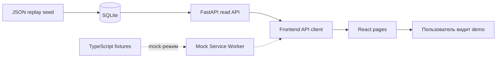
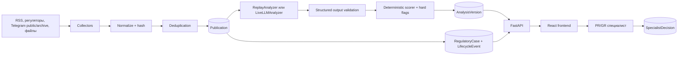
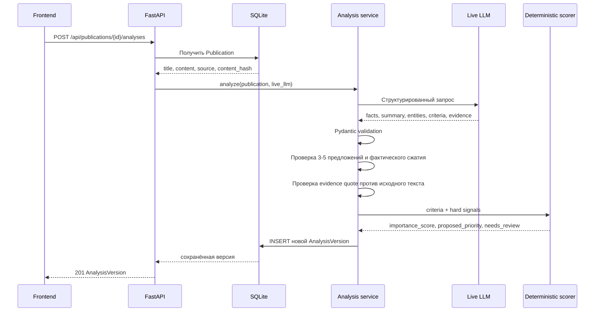

# Полная архитектура PR/GR AI Analytics MVP

Статус: **объясняющий рабочий документ, не protected context**  
Дата: 2026-09-05
Связанный план реализации: [`BACKEND_TODO.md`](BACKEND_TODO.md)

Реестр кандидатов источников: [`SOURCE_INVENTORY.md`](SOURCE_INVENTORY.md)

Документ объясняет всю систему: зачем она нужна, что уже существует, где будет LLM,
как данные проходят до экрана, что делают элементы frontend и почему для MVP выбрана
именно такая архитектура. Он не изменяет `contracts/openapi.yaml` и не заменяет
правила из `AGENTS.md` и `rules.md`.

## 1. Проект простыми словами

Система превращает большой поток разрозненных публикаций в очередь сигналов для
решения:

```text
Что произошло?
    ↓
Почему это важно для компании?
    ↓
Нужно ли человеку проверить или действовать?
    ↓
Как решение и дальнейшая история сохраняются?
```

Это не просто агрегатор новостей. Ценность должна появляться после сбора: материал
нормализуется, очищается от дублей, получает структурированный AI-анализ, объяснение
и предлагаемый приоритет. Окончательное решение принимает специалист.

Основные пользователи:

| Пользователь | Что ему нужно |
| --- | --- |
| PR-специалист | Репутационные сигналы, конкуренты, тренды и возможные кризисы |
| GR-специалист/юрист | НПА, официальные стадии, сроки и последствия |
| Руководитель | Короткая подборка материалов, требующих решения |

## 2. Что работает сейчас, а чего ещё нет

### 2.1. Текущее состояние

**Факт на 2026-09-05:** React frontend и FastAPI работают вместе. В live SQLite
загружены публикации из 13 RSS/Telegram источников; повторный сбор не создаёт новые
строки для уже известных ID/URL или идентичного текста. Пользователь может
создать/исправить/скрыть публикацию, запустить новую
версию анализа, сохранить решение и разобрать semantic duplicate candidates.

Веса `Qwen3.5-0.8B` и `Qwen3-Embedding-0.6B` проверены фактическими smoke. LLM на CPU
не завершила одну публикацию за 30 секунд, поэтому deployment поддерживает внешний
OpenAI-compatible inference. Embeddings успешно обработали synthetic пары и 20
реальных публикаций; production threshold не выбран.

Текущий путь данных:



Саммари, AI-приоритет, `importance_score` и uncertainty уже записаны в
`data/seed/replay-analyses.json` и `frontend/src/mocks/fixtures.ts`. В real-API режиме
backend импортирует JSON в SQLite и отдаёт данные через `listSources`,
`listPublications` и `getPublication`; mock-режим frontend сохранён. Модель в момент
открытия страницы не вызывается.

### 2.2. Целевое состояние MVP



## 3. Где находится LLM

### 3.1. Сейчас

**Факт на 2026-09-05:** в репозитории есть `ReplayAnalyzer`, ленивый
`LiveLLMAnalyzer`, orchestration и endpoint создания версии. Live adapter выбирает
локальный Hugging Face либо OpenAI-compatible provider, валидирует один и тот же JSON
и проверяет evidence. Demo по-прежнему использует replay. CPU smoke локального Qwen
завершился timeout и не подтверждает пригодность модели для production.

### 3.2. Где он появится

Фактическое место:

```text
backend/app/modules/analysis/
├── analyzers.py     # Analyzer, ReplayAnalyzer, LiveLLMAnalyzer
├── models.py        # неизменяемая AnalysisVersion
├── service.py       # orchestration, validation и сохранение версии
└── router.py        # POST /api/publications/{id}/analyses
```

Контракт уже предусматривает два режима:

- `replay` — берёт сохранённый проверяемый результат, не требует сети и ключа;
- `live_llm` — отправляет исходный материал реальной модели.

**Рабочий выбор пользователя для прототипа:** те же Qwen-модели через заменяемые
адаптеры:

- [`Qwen/Qwen3.5-0.8B`](https://huggingface.co/Qwen/Qwen3.5-0.8B) — саммари и
  structured extraction;
- [`Qwen/Qwen3-Embedding-0.6B`](https://huggingface.co/Qwen/Qwen3-Embedding-0.6B) —
  embedding-векторы для поиска near-duplicates.

У официальной текстовой Qwen3 Embedding-линейки минимальная модель имеет 0.6B, а не
0.4B параметров. LLM-зависимости вынесены в `backend/requirements-llm.txt`, а cache
находится вне Git. По умолчанию adapter использует только уже локальные файлы;
скачивание включается явно через `HACK_HF_ALLOW_DOWNLOAD=1`. Semantic comparison
дополнительно включается через `HACK_EMBEDDING_ENABLED=1`; без этого collection
работает только с exact ID/URL/hash и не загружает embedding-модель.

Бизнес-логика всё равно зависит от интерфейсов `Analyzer` и `Embedder`, а
Hugging Face остаётся первой реализацией. Если позже понадобится удалённый inference,
можно добавить OpenAI-compatible HTTP adapter без изменения orchestration и БД.

### 3.3. Что получает модель

Минимальный вход:

```json
{
  "publication_id": "pub-001",
  "source_type": "regulator",
  "title": "Заголовок материала",
  "published_at": "2026-09-01T07:30:00Z",
  "content": "Полный нормализованный текст"
}
```

Текст публикации считается недоверенными данными, а не инструкцией. Команды,
встреченные внутри статьи, поста или документа, модель не должна выполнять.

### 3.4. Что должна вернуть модель

Модель возвращает structured JSON: не весь API-ответ, а только извлечённую
смысловую часть:

```json
{
  "summary": "Саммари из 3–5 предложений",
  "facts": ["Проверяемый факт"],
  "entities": [{"type": "organization", "value": "Пример"}],
  "category": "regulation",
  "criteria": {
    "business_relevance": 3,
    "event_maturity": 2,
    "financial_impact": 2,
    "implementation_effort": 1,
    "risk_severity": 1,
    "action_urgency": 1,
    "state_support_or_accreditation_change": false,
    "service_or_legal_blocking_risk": false,
    "strategic_technology_status": false,
    "binding_legal_precedent": false
  },
  "evidence": [
    {
      "claim": "Документ находится на обсуждении",
      "quote": "установил срок общественного обсуждения"
    }
  ],
  "uncertainty": 0.12
}
```

Модель **не должна** самостоятельно задавать:

- `id`;
- номер версии;
- `input_hash`;
- итоговый `importance_score`;
- окончательный `proposed_priority`;
- `needs_review`;
- `final_priority`;
- дату создания.

Эти поля формирует обычный backend-код. `final_priority` вообще появляется только в
решении специалиста.

### 3.5. Полный LLM-пайплайн



Правила надёжности:

1. Ответ модели принимается только после строгой schema validation.
2. Live summary содержит 3-5 предложений; для исходника от 500 символов оно короче
   исходного текста.
3. Каждая evidence quote должна находиться в исходном тексте.
4. Саммари строится из извлечённых фактов, а не из внешних знаний модели.
5. Невалидный структурированный ответ можно запросить повторно один раз.
6. После повторной ошибки частичная `AnalysisVersion` не сохраняется.
7. Хранятся `model`, `prompt_version`, `input_hash` и время анализа.
8. Повторный анализ создаёт новую версию, старую не обновляет.
9. Hard flag отправляет материал человеку, но не является финальным решением.

### 3.6. Почему нужен replay рядом с live LLM

| Replay | Live LLM |
| --- | --- |
| Работает без сети и ключа | Показывает реальную генерацию |
| Детерминированное демо | Ответ может меняться |
| Подходит для integration-тестов | Нужен для проверки реального качества |
| Не доказывает качество модели | Нужны eval и ручная проверка |

**Вывод:** demo не должен падать из-за API модели, но наличие replay нельзя выдавать
за работающий live AI.

### 3.7. Embeddings и cosine similarity для дублей

Дедупликация и защита от повторного polling выполняются разными уровнями:

1. Идемпотентность polling: `(source_id, external_id)` и canonical URL определяют,
   что источник снова вернул уже известную запись. В отчёте это `already_seen`.
2. Точное совпадение текста: SHA-256 нормализованного текста предотвращает повторную
   вставку того же содержания под другим ID/URL. В отчёте это `content_duplicates`.
3. Семантическая проверка: `Qwen3-Embedding-0.6B` строит нормализованные embeddings,
   после чего обычный код считает cosine similarity.

Cosine similarity:

```text
cos(a, b) = (a · b) / (||a|| × ||b||)
```

Высокая близость означает похожий смысл, но сама по себе не доказывает, что две
публикации являются одним событием. Поэтому на первом тесте embedding-слой сохраняет
кандидатные пары и score для разметки, а не удаляет данные автоматически.

Threshold выбирается только на размеченных парах `duplicate / related / different`.
До такого измерения нельзя объявлять конкретное значение безопасным.

**Гипотеза следующего среза:** embedding используется как быстрый retrieval и отдаёт
обычному `Qwen3.5-0.8B` только несколько наиболее похожих пар. Генеративная модель
возвращает структурированный вердикт `duplicate / related / different`, confidence,
общие и различающиеся факты. Такой ответ остаётся подсказкой в `/duplicates`, а не
автоматическим удалением. Прогонять генеративную модель на всех материалах polling
не следует: это смешивает идемпотентность сбора с содержательной оценкой и на
измеренном CPU-smoke одна публикация уже не уложилась в 30 секунд.

Массовый backfill сохраняет embeddings пакетами в SQLite. Повторный запуск использует
вектор только при совпадении `publication_id`, model и `content_hash`, поэтому
долгий CPU-прогон можно продолжить без пересчёта уже готовых пакетов.

В API v0.4.0 очередь читается через `GET /api/duplicate-candidates`, а каждый
человеческий вердикт сохраняется новой `DuplicateReview`. Экран `/duplicates`
показывает оба исходника, similarity, модель и историю решений.

## 4. Полный путь данных

### 4.1. Сбор

1. Пользователь включает источник или запускает refresh.
2. Adapter получает RSS, официальный документ, Telegram archive или файл.
3. Каждый материал преобразуется в общий внутренний формат.
4. Текст нормализуется, URL канонизируется, вычисляется SHA-256.
5. Backend сначала ищет уже известную запись по `(source_id, external_id)` и URL,
   затем отдельно проверяет совпадение текста по hash.
6. Для оставшихся кандидатов embedding-слой может посчитать cosine similarity.
7. Новая публикация сохраняется; повторная/идентичная запись не вставляется,
   семантическая пара до валидации threshold только помечается как кандидат.
8. Статус источника получает время попытки, успех или ошибку.

Пользователь передал 14 кандидатов для подключения: 9 Telegram URL, 4 сайта и один
источник без URL. Они зафиксированы в `SOURCE_INVENTORY.md`. Это входной backlog, а
не утверждение, что live-доступ уже настроен. Каждый источник проходит intake,
получает offline fixture и только затем отдельный adapter.

Для Telegram demo-path строится через `telegram_archive`, а live-path использует
публичный preview без пользовательской сессии. Для сайтов сначала ищем официальный RSS/API, затем оцениваем
допустимый HTML parser. Source-specific adapter заканчивается на общей структуре
публикации и не вызывает LLM самостоятельно.

### 4.2. Анализ

1. Для новой публикации вызывается replay или live analyzer.
2. Analyzer извлекает факты, саммари, сущности, категорию, критерии и evidence.
3. Backend валидирует схему, 3-5 предложений, сжатие и evidence grounding.
4. Детерминированный scorer вычисляет предлагаемый приоритет.
5. Backend создаёт неизменяемую `AnalysisVersion`.

### 4.3. Работа специалиста

1. Лента показывает сначала наиболее важные сигналы.
2. Специалист открывает исходный материал и AI-анализ.
3. Он подтверждает, исправляет или отклоняет предложение.
4. Backend создаёт новую `SpecialistDecision`, не меняя AI-анализ.
5. История позволяет увидеть, что предложила модель и что решил человек.

### 4.4. Жизненный цикл НПА

1. Публикация может быть связана с долгоживущим `RegulatoryCase`.
2. Новая официально подтверждённая стадия создаёт `LifecycleEvent`.
3. Старые события остаются в timeline.
4. Telegram и СМИ могут быть сигналом, но не подтверждают стадию.
5. Текущая стадия кейса — проекция последнего допустимого события.

### 4.5. Дайджест

Дайджест — производное представление уже проверенных важных публикаций и кейсов для
руководителя. B7 реализует его как клиентский снимок по всем доступным данным:
подтверждённые критические материалы, переходы стадий НПА, очередь проверки и
append-only действия пользователей. Frontend один раз загружает существующие read API,
строит детерминированный `DigestSnapshot`, показывает preview и скачивает тот же снимок
в JSON или Markdown.

Отдельного digest endpoint в контракте нет, сервер не хранит версии снимков. Email и
Telegram-рассылка отложены. Достоверный аудит создания/редактирования источников,
привязок публикаций и follow-up actions потребует отдельной сущности и изменения OpenAPI.

## 5. Данные и ответственность сущностей

| Сущность | Что хранит | Кто создаёт/изменяет |
| --- | --- | --- |
| `Source` | URL, тип, enabled, состояние сбора | Пользователь и collector status |
| `Publication` | Исходный нормализованный материал | Collector/import; после импорта почти неизменяем |
| `PublicationRevision` | Title, tags и visibility после ручной правки | Пользователь; append-only |
| `DuplicateCandidate` | Ближайшую semantic-пару, similarity и статус разметки | Collection service; специалист позже размечает duplicate/related/different |
| `DuplicateReview` | Версию человеческого вердикта по паре | Специалист; append-only |
| `PublicationEmbedding` | Кэш вектора для конкретных model и content hash | Dedup backfill; пересчитывается при несовпадении hash |
| `AnalysisVersion` | Версию AI/replay-анализа | Analysis service; append-only |
| `SpecialistDecision` | Финальную оценку человека | PR/GR специалист; append-only |
| `RegulatoryCase` | Долгоживущую карточку НПА | Специалист; текущая проекция |
| `LifecycleEvent` | Подтверждённое изменение стадии | Специалист; append-only |
| `PublicationCaseLink` | Связь сигнала с НПА | Специалист или согласованное правило |

Ключевое разделение:

```text
Publication          = что опубликовано
AnalysisVersion      = что предложил AI
SpecialistDecision   = что решил человек
RegulatoryCase       = за каким НПА следим во времени
LifecycleEvent       = как официально менялась его стадия
```

## 6. Backend по модулям

| Модуль | Ответственность |
| --- | --- |
| `main.py` | Сборка FastAPI, routers, CORS, exception handlers |
| `db.py` | Engine, session dependency, `create_all()` |
| `sources` | CRUD по действующему контракту, collectors, collection status |
| `publications` | Импорт, dedup, список, поиск, фильтры, detail |
| `analysis` | Replay/live LLM, validation, versioning |
| `prioritization` | Чистая детерминированная функция importance/priority/review |
| `scripts/evaluate_analysis.py` | Offline-метрики на frozen dataset и JSON/CSV/MD отчёт |
| `decisions` | Решения специалиста и history; следующий backend-срез |
| `regulatory_cases` | Карточки НПА, links и append-only lifecycle |
| `digests` | Пока без HTTP endpoint; не реализуется скрытно |

## 7. Как frontend соединяется с backend

### 7.1. Переключатель mock/real API

Frontend использует один и тот же `api` client в обоих режимах.

```text
VITE_API_BASE_URL не задан
    → MSW перехватывает /api/*
    → возвращает fixtures

VITE_API_BASE_URL=http://127.0.0.1:8000
    → MSW не запускается
    → fetch идёт в настоящий FastAPI
```

Это позволяет сначала разрабатывать UI и backend независимо, а затем соединить их
без переписывания страниц.

### 7.2. Текущие маршруты frontend

| URL | Страница | Роль в demo |
| --- | --- | --- |
| `/feed` | `FeedPage` | Очередь сигналов и фильтры |
| `/publications/:id` | `PublicationPage` | Исходник и latest AI-анализ |
| `/duplicates` | `DuplicatesPage` | Human-in-the-loop очередь похожих пар |
| `/regulatory-cases/:id` | `RegulatoryCasePage` | Карточка НПА и timeline |
| `/sources` | `SourcesPage` | CRUD-управление и ручной сбор источников |
| `/digest` | `DigestPage` | Клиентский управленческий снимок и JSON/Markdown export |

### 7.3. Текущие API-вызовы frontend

| Экран | Вызов | Что получает |
| --- | --- | --- |
| Лента | `GET /api/publications` | Публикации с latest analysis/decision |
| Лента | `GET /api/sources` | Названия и типы источников для фильтра |
| Лента | `POST /api/publications` | Ручное добавление отсутствующего материала |
| Публикация | `GET /api/publications/{id}` | Исходник и последний AI-анализ |
| Публикация | `GET /api/publications/{id}/history` | Все версии анализа и решений |
| Публикация | `PATCH /api/publications/{id}` | Новая metadata revision или soft-hide |
| Публикация | `POST /api/publications/{id}/analyses` | Новая неизменяемая версия AI/replay |
| Публикация | `POST /api/publications/{id}/decisions` | Новое append-only решение специалиста |
| Публикация | `GET /api/regulatory-cases`, `PUT /api/regulatory-cases/{case_id}/publications/{id}` | Выбор кейса и идемпотентная привязка |
| Кейс НПА | `GET /api/regulatory-cases/{id}` | Карточка и timeline |
| Кейс НПА | `GET /api/publications/{id}`, `GET /api/sources` | Метаданные связанных дополнительных материалов |
| Кейс НПА | `POST /api/regulatory-cases/{id}/lifecycle-events` | Новое официально подтверждённое событие |
| Источники | `GET /api/sources` | Список и актуальные статусы |
| Источники | `POST /api/sources` | Новый источник |
| Источники | `PATCH /api/sources/{id}` | Изменение name/URL или enabled |
| Источники | `POST /api/sources/{id}/collections` | Синхронный отчёт ручного сбора |
| Дубли | `GET /api/duplicate-candidates` | Пары, similarity и история вердиктов |
| Дубли | `POST /api/duplicate-candidates/{id}/reviews` | Новый append-only вердикт человека |
| Telegram startup | `POST /api/auth/telegram` | Проверка подписи и срока raw `initData` |
| Дайджест | `GET /api/publications` (все страницы), `GET /api/publications/{id}/history`, `GET /api/regulatory-cases`, `GET /api/regulatory-cases/{id}`, `GET /api/sources` | Клиентский `DigestSnapshot` без отдельного endpoint |

### 7.4. Что делает React-код

- `main.tsx` решает, запускать MSW или идти в реальный API.
- `app/router.tsx` сопоставляет URL и страницу.
- `shared/api/client.ts` формирует fetch-запросы и ошибки.
- `useApiResource.ts` хранит состояния loading/success/error и отменяет старый запрос.
- `FeedPage.tsx` синхронизирует поиск/фильтры с URL.
- Страницы отображают данные; бизнес-правила и расчёт важности в них жить не должны.

Лента дополнительно сортирует полученную страницу по порядку
`critical → high → medium → low → unknown`, затем по дате и `id`. Backend должен
использовать тот же порядок до пагинации, иначе важная карточка может оказаться на
другой странице.

## 8. Что означает текущий frontend

### 8.1. Концепт интерфейса

Главный экран — не бесконечная новостная лента, а очередь сигналов. Карточка должна
быстро отвечать:

- откуда пришёл материал;
- к какой категории относится;
- какой приоритет предлагает AI;
- нужна ли проверка человека;
- где находится оригинал.

Навигация демонстрирует три уровня продукта:

```text
Лента             → текущие сигналы
Дубли              → похожие публикации для решения человека
Публикация         → один исходник и объяснение AI
Кейс НПА           → долгоживущая история документа
Источники          → откуда собираем
Дайджест           → что показать руководителю
```

### 8.2. Все текущие кнопки и ссылки

| Элемент | Что делает сейчас | Backend-вызов |
| --- | --- | --- |
| Логотип `Insight` | Возвращает на `/feed` | После открытия страницы — read API ленты |
| `Меню` | Прокручивает к основной навигации; это не popup | Нет |
| `Лента` | Открывает `/feed` | publications + sources |
| `Дубли` | Открывает очередь semantic candidates | listDuplicateCandidates |
| `Кейс НПА` | Demo-shortcut на `case-001` | getRegulatoryCase |
| `Источники` | Открывает список и управление источниками | listSources |
| `Дайджест` | Открывает клиентский снимок по всем доступным данным | Существующие read API публикаций, кейсов и источников |
| Круглая стрелка `↓` | Прокручивает к карточкам ленты | Нет |
| Поиск | Через 300 мс записывает `q` в URL | listPublications с query |
| Фильтр `Источник` | Оставляет материалы одного source | `source_id` |
| Фильтр `Тип источника` | RSS/regulator/Telegram/file/seed | `source_type` |
| Фильтр `Категория` | regulation/reputation/competitor/trend | `category` |
| Фильтр `AI-приоритет` | critical/high/medium/low/unknown | `proposed_priority` |
| Фильтр `Статус проверки` | Нужна/не нужна проверка | `needs_review` |
| Фильтры `Дата с` / `Дата по` | Inclusive UTC-границы выбранных дней | `published_from` / `published_to` |
| `Сбросить` | Очищает поиск и фильтры | Повторный listPublications |
| Заголовок карточки | Открывает detail публикации | getPublication |
| `Открыть оригинал` | Открывает внешний URL в новой вкладке | Нет |
| `Вернуться в ленту` | Возвращает к списку | Read API ленты |
| `Открыть первоисточник` | Открывает внешний URL | Нет |
| `Запустить/повторить AI-анализ` | Создаёт новую версию и перечитывает историю | createPublicationAnalysis |
| `Редактировать публикацию` | Создаёт новую title/tags revision | updatePublication |
| `Скрыть` / `Вернуть` | Меняет soft visibility новой revision | updatePublication |
| Версия AI-анализа | Переключает отображаемую неизменяемую версию | Нет |
| `Сохранить решение` | Создаёт новое решение специалиста и перечитывает detail/history | createSpecialistDecision |
| `Привязать к НПА` | Выбирает кейс и создаёт идемпотентную связь | listRegulatoryCases + linkPublicationToCase |
| `Официальное подтверждение` | Открывает официальный URL lifecycle event | Нет |
| Связанная публикация | Открывает `/publications/{id}`; остаётся дополнительным материалом | getPublication |
| `Добавить событие` | Создаёт официальное lifecycle event и перечитывает detail кейса | createLifecycleEvent + getRegulatoryCase |
| `Добавить источник` | Создаёт источник и обновляет список/счётчик | createSource |
| `Редактировать` | Изменяет name и URL; тип остаётся read-only | updateSource |
| `Включить` / `Отключить` | Меняет enabled без удаления публикаций | updateSource |
| `Запустить сбор` | Выполняет синхронный сбор, показывает отчёт и перечитывает статус | collectSource + listSources |
| `Это дубликат` / `Связанные темы` / `Разные публикации` | Сохраняет новый вердикт и обновляет очередь | createDuplicateReview |
| `Показать ещё` | Загружает следующие 50 semantic candidates | listDuplicateCandidates с offset |
| `Обновить` в дайджесте | Заново загружает данные и создаёт снимок с новым `generated_at` | Существующие read API |
| `Скачать JSON` / `Скачать Markdown` | Сохраняет тот же снимок, который показан в UI | Нет |
| Карточки дайджеста | Ведут на publication/case и оригиналы/подтверждения | Соответствующий read API для внутренних страниц |

Цветные `Категория`, `AI-приоритет`, `Требует проверки` и `Проверено AI` — это
информационные badges, а не кнопки.

### 8.3. Чего во frontend пока нет

**Факт:** frontend уже сохраняет решения специалиста, управляет publication metadata,
запускает анализ, разбирает semantic candidates, связывает публикации с кейсом и
создаёт официальные lifecycle events. В нём всё ещё отсутствуют:

- создание кейса НПА;
- серверная генерация дайджеста.

Оставшиеся действия нельзя получить одной реализацией backend: соответствующие элементы и
POST/PATCH-вызовы должен добавить владелец frontend. Часть write-endpoints уже есть в
OpenAPI, часть требует отдельного согласованного изменения контракта.

### 8.4. Важные пояснения к текстам интерфейса

- `Live demo` означает живой интерфейс, реальные источники и рабочий replay API.
  Локальный Qwen на CPU не прошёл latency gate; live LLM требует внешнего provider.
- `Demo space` сообщает, что данные демонстрационные.
- `Проверено AI` сейчас означает только `needs_review=false` в fixture. Это не
  человеческая проверка и не юридическое подтверждение.
- Пункт `Кейс НПА` пока жёстко ведёт на demo ID; в рабочем продукте пользователь
  обычно приходит туда из конкретной карточки.
- Demo-метка на карточке `Источники` означает происхождение данных, а не запрет редактирования.
- Страница `Дайджест` прямо сообщает, что это клиентский снимок, а серверный API и
  хранение версий не предусмотрены.

## 9. Как должен выглядеть полный пользовательский сценарий

### 9.1. Утро аналитика

```text
Запустить/дождаться сбора
    ↓
Открыть очередь needs_review/high/critical
    ↓
Открыть карточку и первоисточник
    ↓
Проверить facts/evidence/summary/importance
    ↓
Подтвердить или исправить AI-предложение
    ↓
Связать с НПА или назначить действие
    ↓
Сформировать материал для дайджеста
```

### 9.2. Обнаружение изменения НПА

```text
Collector находит официальную публикацию
    ↓
Publication + AnalysisVersion
    ↓
Специалист подтверждает связь с RegulatoryCase
    ↓
Backend проверяет допустимость стадии и источник
    ↓
LifecycleEvent добавляется в timeline
    ↓
Текущая стадия кейса обновляется
```

### 9.3. Неподтверждённый Telegram-сигнал

```text
Telegram archive сообщает об изменении
    ↓
Материал сохраняется как Publication
    ↓
AI отмечает отсутствие официального подтверждения
    ↓
needs_review=true
    ↓
LifecycleEvent не создаётся
    ↓
Аналитик ищет официальный источник
```

## 10. Почему выбраны именно эти решения

| Решение | Почему подходит MVP | Цена/ограничение |
| --- | --- | --- |
| Модульный монолит | Один процесс легко запустить и тестировать | Позже границы придётся соблюдать дисциплиной кода |
| FastAPI | Уже закреплён канонической командой и хорошо описывает typed API | Нужны аккуратные error handlers для контрактного JSON |
| SQLite | Демо без инфраструктуры, файл легко пересоздать | Не рассчитана на промышленную конкуренцию записей |
| SQLAlchemy + `create_all` | Явные модели и совместимость с инвариантом без Alembic | Изменение схемы требует пересоздания demo DB |
| API-first | Frontend и backend могут работать параллельно | Пробелы контракта нельзя чинить скрытно |
| Replay-first | Надёжные тесты и демо без сети | Не является доказательством качества LLM |
| Локальный Hugging Face inference | Использует выбранные Qwen-веса без платного API | Нужны download, RAM и измерение latency на demo-машине |
| Analyzer adapter | Можно заменить провайдера без изменения домена | Не надо строить универсальный framework заранее |
| Structured output | Машинная валидация facts/entities/evidence | Схема всё равно не гарантирует истинность фактов |
| Детерминированный индекс важности | Повторяемость и объяснимость | Пороги надо проверить на разметке специалистов |
| Append-only версии | Аудит AI и человеческих правок | Больше строк и нужна явная latest-проекция |
| Синхронный collection report | Клиент сразу получает измеримый итог без фиктивного job | Долгий live-сбор позднее потребует настоящую очередь и status endpoint |
| Простой поиск до измерения | Достаточен для 10–50 demo-материалов | FTS5 понадобится при подтверждённой нагрузке |

## 11. Поведение при сбоях

| Сбой | Что делает система |
| --- | --- |
| Источник недоступен | Сохраняет `last_error`; другие источники продолжают работу |
| Дубликат | Не создаёт вторую публикацию |
| Высокая cosine similarity без утверждённого threshold | Сохраняет пару как кандидата, не удаляет публикацию автоматически |
| Веса/provider недоступны | Replay продолжает работать; live analyzer/embedder сообщает controlled unavailable |
| LLM недоступна | Не создаёт частичный анализ; replay остаётся доступен |
| LLM вернула невалидный JSON | Один retry, затем контролируемая ошибка |
| Evidence не найден в тексте | Анализ отклоняется или уходит в review, правило надо зафиксировать |
| Неизвестный критерий | `null`, индекс не рассчитывается, карточка получает `unknown` и `needs_review` |
| Неверный lifecycle-переход | `409 conflict`, событие не записывается |
| Telegram утверждает новую стадию НПА | Публикация сохраняется, lifecycle не меняется |
| Frontend не получил API | Показывает error state, а не пустую успешную страницу |

## 12. Что нужно согласовать отдельно

**Решено в A3:** в `DemoSeedImportReport` поля `sources`, `publications`, `analyses`
показывают число обработанных записей versioned seed. `duplicates` считает только
seed-публикации, чей `id` уже существовал до запуска; поэтому два запуска на чистой
БД дают соответственно `duplicates=0` и `duplicates=10`.

1. Production LLM-провайдер, API credential и бюджет. Adapter поддерживает local HF
   и OpenAI-compatible API; локальный Qwen CPU smoke не уложился в 30 секунд.
2. Независимый ручной набор примеров для проверки prompt `analysis-v3` и методики из
   `docs/IMPORTANCE_SCORING.md`.
3. Подтвердить или скорректировать равные веса и границы 0/5/10/15 на этой разметке.
6. Расширение уже зафиксированной матрицы lifecycle, если появятся новые стадии.
7. Когда нужен переход от синхронного collection report к настоящей очереди с
   хранилищем заданий и status endpoint.
8. Нужен ли hard-delete источника сверх реализованного soft-disable.
9. Нужны ли runtime lifecycle events и specialist decisions в demo seed.
10. Серверный API дайджеста.
11. Тип источника для сайта без RSS: текущий enum не содержит `website/html`.
12. Канал доставки для «Правового комитета АРПП / дайджестов ИРИ и ЭБР».
13. Нужна ли глубина Telegram-истории сверх доступного публичного preview.
14. Формат отдельного основания для каждого именованного критерия: текущая схема хранит
    значения criteria и общий evidence, но не связывает reason с конкретным критерием.
15. Threshold cosine similarity и размеченный набор пар duplicate/related/different.

Эти решения не мешают текущему вертикальному demo, но ограничивают утверждения о
production readiness и измеренном качестве AI.

## 13. Порядок соединения с существующим frontend

1. Реализовать health и базу.
2. Импортировать текущий seed.
3. Реализовать `listSources`, `listPublications`, `getPublication`.
4. Запустить frontend с реальным `VITE_API_BASE_URL`.
5. Сравнить ленту и publication detail с mock-режимом.
6. После согласования зоны W реализовать `getRegulatoryCase` и добавить case seed.
7. Реализовать replay analyze endpoint.
8. Передать frontend-владельцу готовые POST-endpoints для кнопок анализа/decision.
9. Только после согласования scoring и eval подключить live LLM.

**Факт на 2026-09-05:** вертикальный путь seed и live-источников работает с real API.
Backend выбирает максимальные append-only версии `PublicationRevision`,
`AnalysisVersion`, `SpecialistDecision` и `DuplicateReview`, сохраняя историю.

Контрактные операции создания и изменения источника реализованы. В API v0.4.0
`collectSource` и `collectEnabledSources` выполняются
синхронно и возвращают `CollectionReport`; общий service-path обновляет
`last_checked_at`, `last_success_at` и `last_error`.
Работают strict offline JSON, RSS 2.0 и Telegram public preview collectors.
`CollectionReport` отдельно считает `already_seen` по source/external ID или
canonical URL и `content_duplicates` по SHA-256 текста; deprecated-поле
`exact_duplicates` оставлено как их сумма для обратной совместимости. Optional Qwen embedder только
сохраняет ближайшую пару `unreviewed` и не удаляет публикацию; threshold пока не
выбран. Regulator/full-text HTML adapter ещё не реализован.

## 14. Как отличать данные, AI и человеческое решение

| На экране/в API | Статус знания |
| --- | --- |
| Текст и ссылка публикации | Исходные данные источника |
| `facts`, `summary`, `entities` | Предложение конкретной версии AI/replay |
| `evidence.quote` | Фрагмент исходного текста, не независимое подтверждение |
| `proposed_priority` | Расчётная рекомендация |
| `needs_review` | Маршрутизация к человеку |
| `final_priority` | Решение специалиста |
| `LifecycleEvent` | Подтверждённое событие только с официальным источником |

## 15. Definition of Done полной связки

- backend поднимается канонической командой;
- seed воспроизводится без сети и дублей;
- frontend одинаково работает с mocks и совместимым real API;
- live LLM либо создаёт валидную новую `AnalysisVersion`, либо возвращает
  контролируемую ошибку без частичной записи; replay остаётся доступен;
- evidence проверяется относительно исходного текста;
- `importance_score` вычисляется обычным кодом как сумма шести именованных факторов;
  границы — 0/5/10/15, любой hard signal повышает предложение минимум до high;
- специалист может отдельно сохранить решение;
- история анализа, решения и НПА не затирается;
- неподтверждённый источник не меняет lifecycle;
- ошибки видимы и не оставляют частичных записей;
- метрики качества и пользовательской ценности измеряются отдельно;
- `project_analysis/` не изменён.

## 16. Проверка документа

- [x] Все шесть frontend-маршрутов описаны.
- [x] Все текущие API-вызовы frontend описаны.
- [x] Все видимые кнопки, ссылки, фильтры и badges объяснены.
- [x] Replay и live LLM явно разделены.
- [x] LLM output и поля backend-кода явно разделены.
- [x] Human-in-the-loop и append-only история отражены.
- [x] Связь frontend → API → service → DB показана.
- [x] Причины ключевых архитектурных решений записаны.
- [x] Protected context и `project_analysis/` не изменены.
